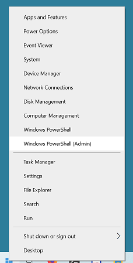

# Service Application Runner (SAR)

This is a simple tool to run windows applications as a system service. It is a replacement for srvany.exe from Windows NT Resource Kit as it is no longer available.

I have used it to run [Syncthing](https://syncthing.net/) windows console application, but it may be used to run any other application.

## Getting started

Download SAR.zip from "Releases" tab and extract SAR.exe from archive into any destination directory. For example C:\Users\<UserName>\tools\SAR

## Creating service

Run PowerShell as System Administrator (Righ click on "Start" button and select Windows PowerShell(Admin))



* Go to directory with extracted SAR.exe
* Run cmdlet `New-Service <ServiceName> -BinaryPathName "C:\Users\<UserName>\tools\SAR\SAR.exe <Path to application with param>"`

Example:

```
New-Service "Syncthing" -BinaryPathName "C:\Users\ybereza\tools\SAR\SAR.exe C:\Users\ybereza\tools\syncthing.exe -no-browser -no-console -no-restart -logfile C:\Users\ybereza\tools\syncthing\log.txt"
```

Now you can start your service from "Services" Application.


## Troubleshooting

If there was an error during application start, it will be shown in System Event Log. Press "Start" button and type "Event Viewer", now go to Applications and System Services log and locate "Service Application Runner" log file

